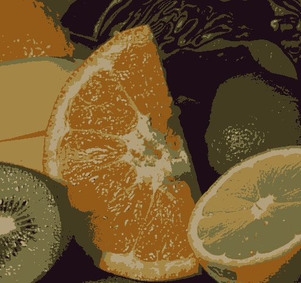

# Image-Processing

## Basic &amp; highly undocumented implementation of some image processing tools in C++ and OpenCV.
## The list includes:

- *Digital filters*
- *Detectors*
- *Region-based image segementation algorithms*
- *Clustering-based image segementation algorithms*

The code is poorly commented, and mostly in italian. Many of these tools are built in into openCV and other similar libraries.
Still I decided to upload them as some curious student may be looking to understand the logic behind these algorithms.

/output.png)

